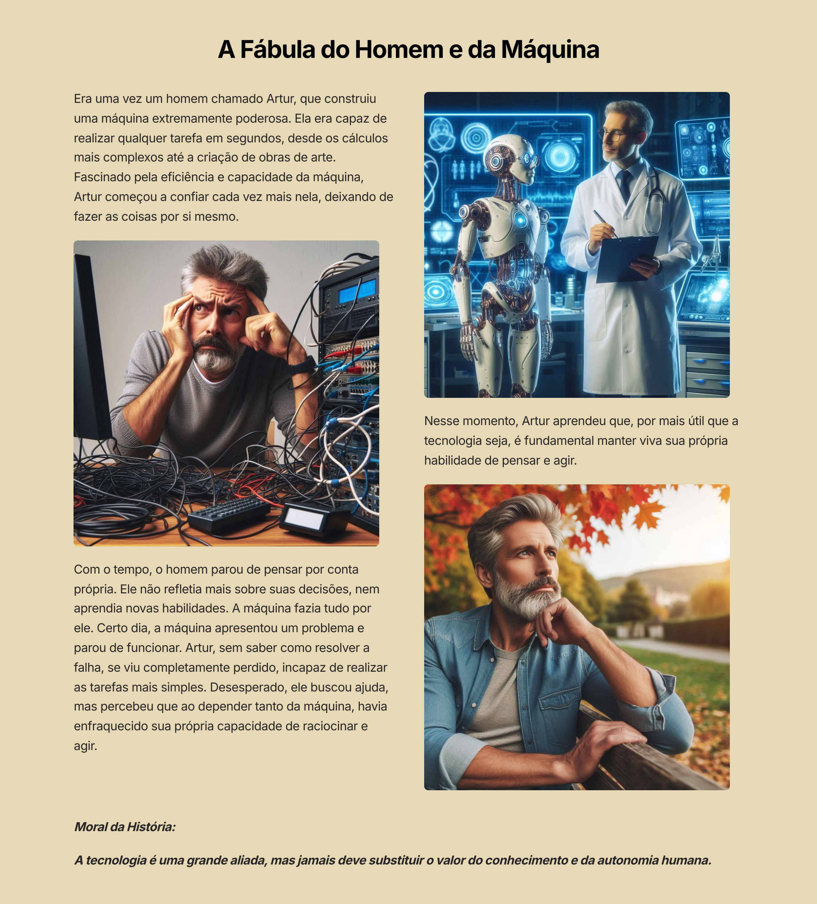

# A Fábula de Artur e a Máquina;)

## 📒 Descrição
Tive a ideia de criar uma fábula, utilizando 3 IAs diferentes se complmentando para chegarmos ao resultado final.

## 🤖 Tecnologias Utilizadas
ChatGPT: Toda a história foi criada pelo mesmo, onde ele escolher o tema da fábula e desenvolveu sem orientação minha.
Bing: Criação de Ilustrações para complemento da fábula
Gamma: Estruturação e junção da história com as ilustrações

## 🧐 Processo de Criação
Primeiramente,pedi ao ChatGPT que criasse uma breve fábula sobre a relação entre o homem e a máquina. A narrativa foi centrada em um homem chamado Artur, que, ao depender completamente de uma máquina para realizar suas tarefas, acabou perdendo sua autonomia e capacidade de pensar por conta própria. A lição de moral reforçou a importância de manter o conhecimento humano ativo, mesmo com o avanço da tecnologia.

Após a criação da história, utilizei o Bing para criar ilustrações que complementassem a narrativa, criando visuais que capturassem momentos-chave da fábula. Em seguida, recorri ao Gamma para integrar a história e as ilustrações, organizando-as em um formato visual coeso, tornando a fábula mais envolvente e acessível.

## 🚀 Resultados

## 💭 Reflexão (Opcional)
Foi divertido e desafiador, pensar desde o inicio em um resultado que seria alcançado, e utilizar as tecnologias ao meu favor para moldar minha imaginação ao resultado final.
